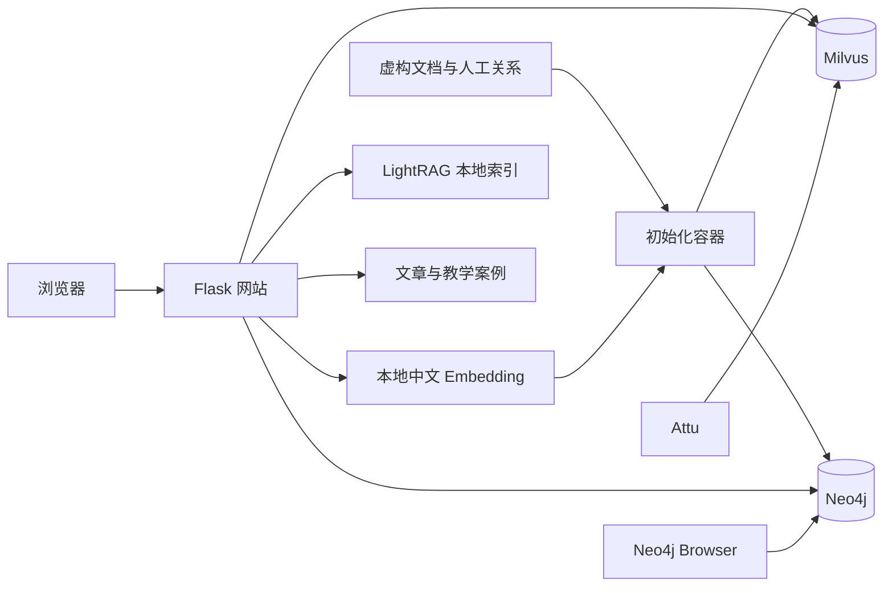

# RAG Knowledge Lab

**把原文、文本切块、向量召回和知识关系放在同一个页面里，看看一次检索到底找到了什么。**

面向技术分享和动手学习的 RAG 数据实验室。项目提供文档阅读工作区、可追溯的检索结果、关系图、九组技术案例和完整中文文章，并用 Docker Compose 打包网站、Milvus、Neo4j 及管理界面。

中文 Embedding 在本地运行，无需模型 API Key。语料全部虚构，适合现场演示和修改实验。

[快速启动](#快速启动) · [分享会怎么演示](#分享会怎么演示) · [真实执行范围](#真实执行范围) · [部署与维护](docs/deployment.md) · [验证记录](VERIFIED.md)

## 能看到什么

| 入口 | 可以观察的内容 |
| --- | --- |
| 文档工作区 | 阅读原文、显示 Chunk 边界、输入问题，从命中结果定位回原文 |
| 检索与关系图 | 对照相似度结果，查看人、任务、项目、接口之间的关联及来源 |
| LightRAG 数据页 | 查看实体描述、关系描述、来源映射和两路索引结果 |
| 九组案例 | 逐步观察 RAG、图检索、全局归纳、LightRAG、时序图谱、PageIndex、Agentic RAG、LLM Wiki、OKF |
| 数据库管理界面 | 在 Attu 中看向量与元数据，在 Neo4j Browser 中看节点、边和路径 |
| 分享文章 | 阅读各方案的原理、流程图、时序图、优缺点和成本比较 |

## 快速启动

准备 Docker Engine 或 Docker Desktop，以及 Docker Compose v2。建议给 Docker 分配至少 **8 GB 内存、10 GB 可用磁盘**。已验证 Linux amd64 容器；Apple Silicon 默认使用模拟运行，原生 ARM 尚未验证。

```bash
git clone https://github.com/HuangJingwang/rag-knowledge-lab.git
cd rag-knowledge-lab
./start.sh
```

启动脚本会生成 `.env`、构建镜像、等待数据库就绪、导入演示数据，然后启动网站。**首次构建需要联网**下载依赖和容器镜像；中文模型已经随仓库携带，运行时无需下载模型。

| 页面 | 默认地址 |
| --- | --- |
| 文档工作区 | [localhost:8018](http://localhost:8018/) |
| 完整文章 | [localhost:8018/article/](http://localhost:8018/article/) |
| 九组案例 | [localhost:8018/examples](http://localhost:8018/examples) |
| LightRAG 数据 | [localhost:8018/entities](http://localhost:8018/entities) |
| Attu | [localhost:8000](http://localhost:8000/) |
| Neo4j Browser | [localhost:7474/browser/](http://localhost:7474/browser/) |

Attu 连接 `milvus:19530`。Neo4j 使用 `bolt://localhost:7687`，用户名 `neo4j`，密码见 `.env` 的 `NEO4J_PASSWORD`。

如果默认端口已被占用，先复制 `.env.example` 为 `.env`，修改对应端口，再运行启动脚本。Windows 的 Compose 命令、局域网访问、离线搬迁与数据更新见[部署说明](docs/deployment.md)。

## 分享会怎么演示

建议按这条路线走，让观众先看到资料，再看到检索和关联的差别。

1. **从原文开始。** 打开文档工作区，显示 Chunk 标注，观察一句规则和它的适用条件是否在同一块里。
2. **问一个具体问题。** 输入“谁负责支付回调改造？”，查看实际召回结果、相似度和出处。命中旧记录时，继续核对最新会议中的人员变化。
3. **沿关系继续找。** 打开“GraphRAG · 关联查询”案例，观察“李明调走后，哪个项目的上线依赖需要重新安排？”如何通过任务和项目关系找到相关材料。
4. **打开数据库。** 在 Attu 中找到同一条 Chunk，再到 Neo4j Browser 查看它对应的节点和关系。可直接使用[示例 Cypher](app/graph/demo_queries.cypher)。
5. **对照其他检索方式。** 运行 LightRAG 案例查看实体与关系两路召回；切换时序案例的观察时间，再用 PageIndex 案例比较“只读规则”和“连同适用条件一起读”。
6. **回到文章做选型。** 用流程图和对比表解释每种方案补了什么能力、又增加了哪些维护成本。

## 真实执行范围

**向量和数据库查询是真实执行的；当前没有接入 LLM 自动抽取或答案生成。** 页面上的教学步骤会标明实现边界。

| 功能 | 当前实现 |
| --- | --- |
| 中文 Embedding | 本地 `BAAI/bge-small-zh-v1.5`，FastEmbed / ONNX Runtime，512 维向量 |
| 传统 RAG 检索 | 真实 Milvus 向量搜索；展示召回证据，没有生成模型和重排模型 |
| 图增强检索 | 真实 Neo4j 向量查询、关系扩展与路径查询；关系由人工整理后导入 |
| 微软 GraphRAG 全局归纳 | 人工编写的社区报告与归纳示例，未执行官方社区发现或 Global Search |
| LightRAG | 真实 LightRAG 1.5.7 实体、关系索引查询；关键词手工指定，未执行完整 hybrid 问答管线 |
| 时序知识图谱 | Neo4j 实际按有效区间和适用范围过滤；未运行 Graphiti 自动抽取 |
| PageIndex | 实际从完整 Markdown 提取目录和行号；摘要与阅读路径为教学设计，未调用官方 PageIndex 推理导航 |
| Agentic RAG | 真实检索与追溯，工具顺序预设，未接入自主规划 Agent |
| LLM Wiki / OKF | 人工维护的知识页与简化元数据示例，未自动修订，也不宣称通过 OKF 官方规范校验 |

因此，这个项目适合解释数据如何组织、检索结果如何回溯，不能用它测量各框架的端到端准确率、LLM 调用成本或生产性能。

## 数据与架构

演示围绕虚构的支付升级、项目交付和接入决策展开，包含跨文档依赖、负责人变动、规则适用条件和结论随时间变化等情况。

| 数据 | 数量 |
| --- | --- |
| 来源资料 | 23 份 |
| 文本 Chunk | 30 个 |
| Neo4j 节点 / 关系 | 66 个 / 126 条 |
| LightRAG 独立快照 | 5 段来源、9 个实体、9 条关系 |

LightRAG 存储是独立的旧快照，不含最新人员调整，不能直接拿它回答最新负责人问题。所有数字对应当前仓库内的演示数据。



网站由 Gunicorn 运行。Compose 根据健康检查安排启动顺序，数据库数据写入命名卷。Milvus 的 etcd、MinIO 依赖也随 Compose 启动。

## 验证与日常操作

```bash
# 查看健康状态；init 正常结束后显示 Exited (0)
docker compose ps --all

# 检查页面、真实检索、图路径、九组案例和时间边界
docker compose exec -T web python /opt/demo/docker/verify.py

# 查看初始化和网站日志
docker compose logs --tail 100 init web

# 停止，保留数据
./stop.sh

# 再次启动
docker compose up -d --wait
```

已验证从空数据库初始化、真实检索、九组案例，以及停止后重新启动的数据保留。详见[验证记录](VERIFIED.md)。模型也已在禁用容器网络的环境中完成索引查询验证。

## 目录

```text
app/
  app.py                  网站入口与检索接口
  data/                   虚构语料、图关系及教学文档
  graph/                  Neo4j 导入脚本与 Cypher 示例
  lightrag-demo/           LightRAG 存储、来源与查询脚本
  templates/、static/     页面与样式
  .cache/models/          随仓库携带的中文模型
article/article.html      完整文章，插图内嵌
compose.yaml              网站、数据库及依赖编排
Dockerfile                网站与模型镜像
docker/                   初始化、健康检查和验证脚本
docs/deployment.md        配置、局域网、维护和离线部署
```

## 分享与使用范围

网站默认允许同局域网访问；Attu 和 Neo4j 管理端口默认仅本机可用，开放方式见[部署说明](docs/deployment.md#局域网分享)。这套演示没有业务登录和权限隔离，适合可信局域网内的技术分享。

`.env`、本机日志、虚拟环境和 Docker 数据卷不进入版本库。模型约 91 MiB，完整文章约 31 MiB，因此初次克隆会比纯代码项目慢。仓库不包含 Docker 基础镜像；完全离线迁移需要先运行 `export-images.sh` 导出镜像。

## 相关项目

[Milvus](https://github.com/milvus-io/milvus) · [Neo4j](https://github.com/neo4j/neo4j) · [Microsoft GraphRAG](https://github.com/microsoft/graphrag) · [LightRAG](https://github.com/HKUDS/LightRAG) · [Graphiti](https://github.com/getzep/graphiti) · [PageIndex](https://github.com/VectifyAI/PageIndex)

本项目独立用于教学演示，与以上项目无官方隶属关系。模型和依赖的来源见[第三方说明](THIRD_PARTY_NOTICES.md)，文章中的技术论述保留了对应参考链接。
