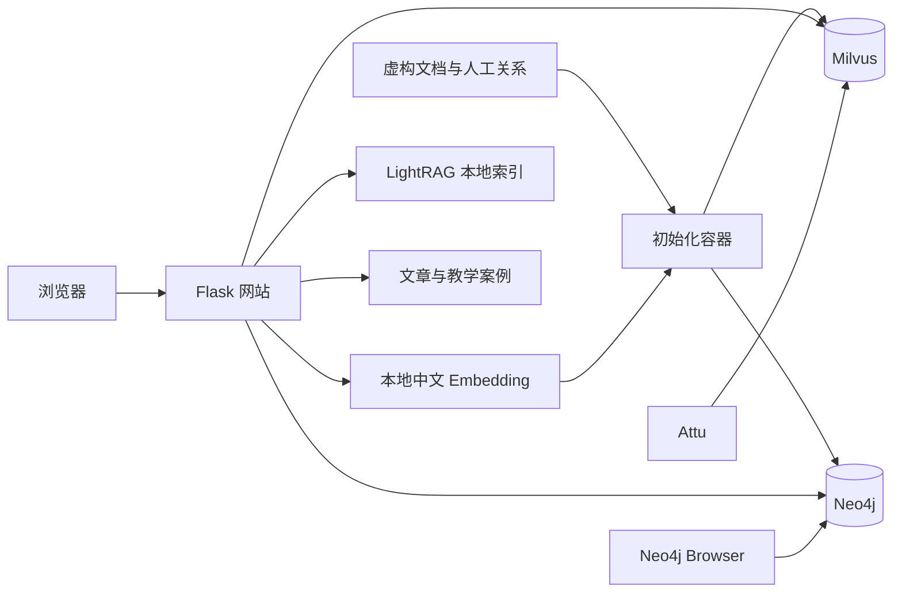

# 实现范围与数据结构

这份说明记录配套示例的实际实现，供需要查看代码和数据库的读者参考。

## 真实执行范围

**向量和数据库查询是真实执行的；当前没有接入 LLM 自动抽取或答案生成。** 页面上的教学步骤会标明实现边界。

| 功能 | 当前实现 |
| --- | --- |
| 中文 Embedding | 本地 `BAAI/bge-small-zh-v1.5`，FastEmbed / ONNX Runtime，512 维向量 |
| 传统 RAG 检索 | 真实 Milvus 向量搜索；展示召回证据，没有生成模型和重排模型 |
| 图增强检索 | 真实 Neo4j 向量查询、关系扩展与路径查询；关系由人工整理后导入 |
| 微软 GraphRAG 全局归纳 | 人工编写的社区报告与归纳示例，未执行官方社区发现或 Global Search |
| LightRAG | 真实 LightRAG 1.5.7 实体、关系索引查询；关键词手工指定，未执行完整 hybrid 问答管线 |
| 时序知识图谱 | Neo4j 实际按有效区间和适用范围过滤；未运行 Graphiti 自动抽取 |
| PageIndex | 实际从完整 Markdown 提取目录和行号；摘要与阅读路径为教学设计，未调用官方 PageIndex 推理导航 |
| Agentic RAG | 真实检索与追溯，工具顺序预设，未接入自主规划 Agent |
| LLM Wiki / OKF | 人工维护的知识页与简化元数据示例，未自动修订，也不宣称通过 OKF 官方规范校验 |

因此，这个项目适合解释数据如何组织、检索结果如何回溯，不能用它测量各框架的端到端准确率、LLM 调用成本或生产性能。

## 数据与架构

演示围绕虚构的支付升级、项目交付和接入决策展开，包含跨文档依赖、负责人变动、规则适用条件和结论随时间变化等情况。

| 数据 | 数量 |
| --- | --- |
| 来源资料 | 23 份 |
| 文本 Chunk | 30 个 |
| Neo4j 节点 / 关系 | 66 个 / 126 条 |
| LightRAG 独立快照 | 5 段来源、9 个实体、9 条关系 |

LightRAG 存储是独立的旧快照，不含最新人员调整，不能直接拿它回答最新负责人问题。所有数字对应当前仓库内的演示数据。

网站由 Gunicorn 运行。Compose 根据健康检查安排启动顺序，数据库数据写入命名卷。Milvus 的 etcd、MinIO 依赖也随 Compose 启动。

验证步骤见[部署说明](deployment.md#验证与维护)，已完成的检查见[验证记录](../VERIFIED.md)。
